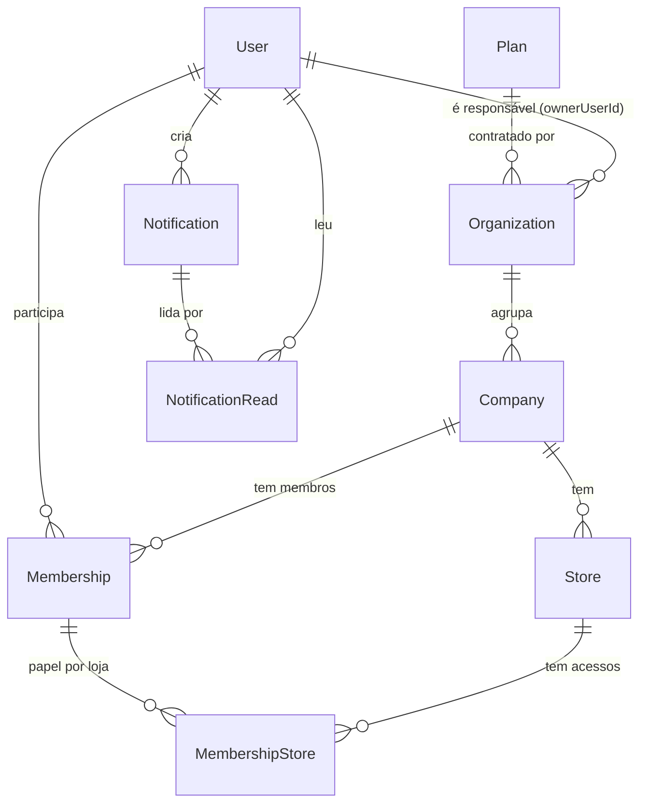
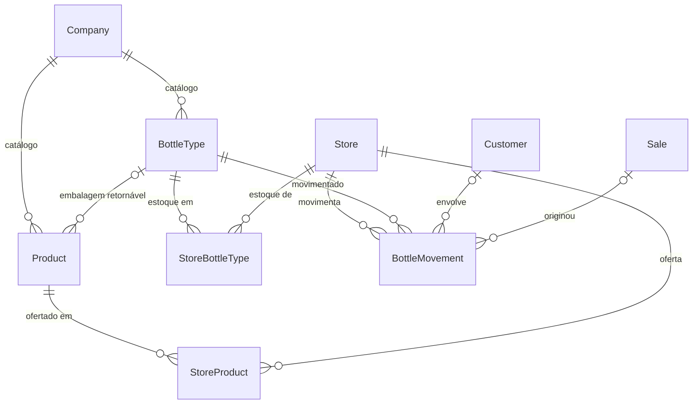
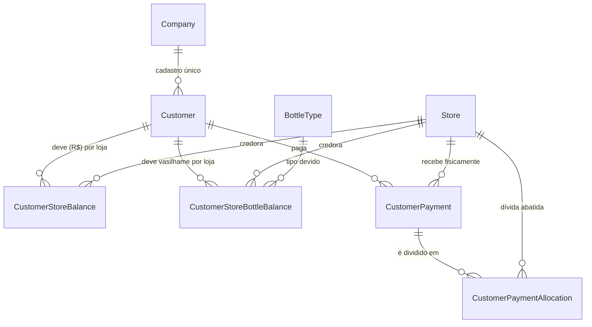
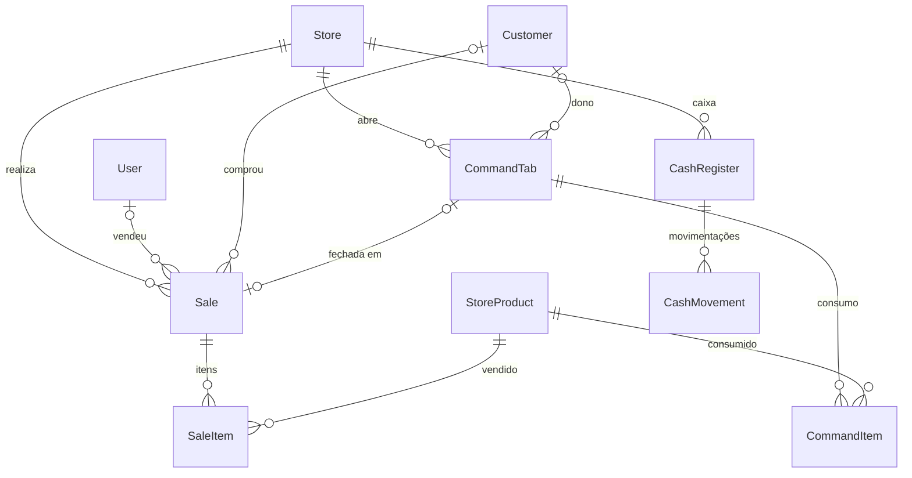

# Banco de Dados

PostgreSQL 16, acessado via Prisma 7. A fonte da verdade é o [schema.prisma](../backend/prisma/schema.prisma); este documento explica como ler e usar esse modelo. Se os dois divergirem, vale o schema.

> **Estado atual:** o banco e o schema já estão no modelo multi-tenant com auditoria. O código do backend (`backend/src`) ainda é o da versão antiga, de uma distribuidora só, e não compila contra este schema. Ele será refatorado seguindo o [plano_implementacao_backend.md](../plano_implementacao_backend.md).

## Sumário

1. [Visão geral](#1-visão-geral)
2. [Diagramas por domínio](#2-diagramas-por-domínio)
3. [Dicionário de tabelas](#3-dicionário-de-tabelas)
4. [Auditoria e histórico](#4-auditoria-e-histórico)
5. [Soft delete](#5-soft-delete)
6. [O que a aplicação precisa fazer](#6-o-que-a-aplicação-precisa-fazer)
7. [Migrations e dia a dia](#7-migrations-e-dia-a-dia)

---

## 1. Visão geral

São 25 tabelas de negócio (`tb_*`) e 25 tabelas de histórico (`th_*_history`, uma para cada). Elas se organizam em cinco domínios:

| Domínio | Tabelas | Em uma frase |
|---|---|---|
| Identidade e multi-tenancy | `tb_plans`, `tb_organizations`, `tb_users`, `tb_companies`, `tb_stores`, `tb_memberships`, `tb_membership_stores` | Quem paga, quem é o dono de quê e quem pode acessar qual loja |
| Catálogo e estoque | `tb_products`, `tb_store_products` | Produto é da distribuidora; preço, custo e estoque são de cada loja |
| Vasilhames | `tb_bottle_types`, `tb_store_bottle_types`, `tb_bottle_movements` | Tipos de vasilhame, estoque físico por loja e o registro de cada movimentação |
| Clientes e fiado | `tb_customers`, `tb_customer_store_balances`, `tb_customer_store_bottle_balances`, `tb_customer_payments`, `tb_customer_payment_allocations` | Cadastro único por distribuidora, dívida separada por loja |
| Vendas e caixa | `tb_sales`, `tb_sale_items`, `tb_command_tabs`, `tb_command_items`, `tb_cash_registers`, `tb_cash_movements` | Tudo que acontece no PDV, por loja |
| Avisos | `tb_notifications`, `tb_notification_reads` | Comunicados do sistema e quem já leu |

### A hierarquia multi-tenant

```
Plan ──< Organization ──< Company ──< Store
                (cobrança)   (distribuidora)   (loja física)
```

- **Organization** é quem contrata e paga o plano (`Plan`). Tem um usuário responsável (`ownerUserId`).
- **Company** é a distribuidora (tenant). Tem catálogo, clientes e tipos de vasilhame próprios, compartilhados entre as suas lojas.
- **Store** é a loja física. Estoque, caixa, vendas e comandas pertencem a ela.
- O acesso de um usuário é definido por `Membership` (vínculo com a Company) e `MembershipStore` (papel dele em cada loja). Um mesmo usuário pode ser `MANAGER` na loja A e `EMPLOYEE` na loja B.

Regra geral: todo dado operacional pertence a uma `Company` (catálogo compartilhado) ou a uma `Store` (operação física). Nenhuma consulta deve ler ou escrever sem validar esse escopo.

### Convenções

- **IDs** são `TEXT` com UUID, gerados pelo Prisma (`@default(uuid())`). Exceção: `tb_membership_stores` e `tb_notification_reads` têm chave primária composta.
- **Nomes:** tabelas em `snake_case` com prefixo (`tb_` negócio, `th_` histórico); colunas em `camelCase`. Como o Postgres converte nomes sem aspas para minúsculas, **em SQL puro as colunas precisam de aspas duplas**: `"storeId"`, `"historyEnd"`.
- **Dinheiro** está em `Float` (R$ com casas decimais). A única exceção é o preço do plano, em centavos inteiros (`Plan.priceInCents`).
- **Datas** são `timestamp` sem fuso, gravadas em UTC.
- **Toda tabela de negócio** tem `modifierId`, `modifiedEndpoint` e `deletedAt` (ver seções 4 a 6).

---

## 2. Diagramas por domínio

Os diagramas mostram só entidades e relações. As colunas estão no [dicionário](#3-dicionário-de-tabelas). A notação é a crow's foot: `||` = exatamente um, `o|` = zero ou um, `o{` = zero ou muitos.

### 2.1 Identidade e multi-tenancy



### 2.2 Catálogo, estoque e vasilhames



### 2.3 Clientes e fiado



### 2.4 Vendas, comandas e caixa



---

## 3. Dicionário de tabelas

Todas as tabelas abaixo também têm `modifierId`, `modifiedEndpoint` e `deletedAt` (omitidos para não repetir). `createdAt` e `updatedAt` existem na maioria; onde não existem, está indicado.

### 3.1 Identidade e multi-tenancy

| Tabela | Para que serve | Colunas e regras principais |
|---|---|---|
| `tb_plans` | Planos de assinatura | `name` (único), `priceInCents`, `maxCompanies` e `maxStoresPerCompany` (`null` = ilimitado) |
| `tb_organizations` | Entidade de cobrança | `ownerUserId` (responsável), `planId`, `subscriptionStatus` (`TRIAL`, `ACTIVE`, `PAST_DUE`, `CANCELED`), ids do Stripe |
| `tb_users` | Login | `email` (único), `passwordHash`, `isActive`, `platformRole` (`SUPPORT`/`SUPERADMIN`, `null` = usuário comum). **Não tem papel fixo**: o papel é por loja |
| `tb_companies` | A distribuidora (tenant) | `cnpj` (único), `razaoSocial`, `nomeFantasia`, `organizationId` |
| `tb_stores` | Loja física | `companyId`, `name`, `cnpj`, `phone` e o endereço (`zipCode`, `street`, `number`, `complement`, `neighborhood`, `city`, `state`) |
| `tb_memberships` | Vínculo usuário ↔ company | Único por (`userId`, `companyId`) |
| `tb_membership_stores` | Papel do vínculo em cada loja | PK composta (`membershipId`, `storeId`); `role`: `OWNER`, `MANAGER`, `EMPLOYEE`. Sem `id`, `createdAt` e `updatedAt` |

### 3.2 Catálogo e estoque

| Tabela | Para que serve | Colunas e regras principais |
|---|---|---|
| `tb_products` | Produto "mestre" da company | `code` (único **por company**), `name`, `packQuantity` (unidades por fardo), `bottleTypeId` (vasilhame retornável, opcional) |
| `tb_store_products` | O produto numa loja | Único por (`storeId`, `productId`). `price`, `costPrice`, `stock` e `isActive` são independentes por loja. Alterar o preço numa loja não afeta a outra nem o `Product` |

`isActive` é regra de negócio ("não vender mais este item") e é diferente de `deletedAt` (registro excluído).

### 3.3 Vasilhames

| Tabela | Para que serve | Colunas e regras principais |
|---|---|---|
| `tb_bottle_types` | Tipo de vasilhame (litrão, 600 ml, engradado…) | Único por (`companyId`, `name`) |
| `tb_store_bottle_types` | Estoque físico do tipo em cada loja | Único por (`storeId`, `bottleTypeId`); `stock`. Sem `createdAt` |
| `tb_bottle_movements` | Registro de cada movimentação | `type`: `CUSTOMER_BORROW`, `CUSTOMER_RETURN`, `SUPPLIER_SEND`, `SUPPLIER_RECEIVE`, `MANUAL_ADJUSTMENT`. `quantity`, `customerId` e `saleId` opcionais. Sem `updatedAt` |

### 3.4 Clientes e fiado

| Tabela | Para que serve | Colunas e regras principais |
|---|---|---|
| `tb_customers` | Cliente da distribuidora | Cadastro único na company; pode comprar e dever em qualquer loja |
| `tb_customer_store_balances` | Dívida em dinheiro (fiado) | Único por (`customerId`, `storeId`); `balance`. O total do cliente é a **soma das linhas**, calculada na hora |
| `tb_customer_store_bottle_balances` | Vasilhames que o cliente deve | Único por (`customerId`, `storeId`, `bottleTypeId`); `balance` (inteiro) |
| `tb_customer_payments` | Pagamento recebido | `storeId` = loja onde o dinheiro foi **fisicamente recebido**; `amount`, `paymentMethod` |
| `tb_customer_payment_allocations` | Para qual dívida o pagamento foi | `paymentId`, `storeId` = loja **cuja dívida foi abatida**, `amount` |

**Abatimento cruzado:** o cliente pode pagar, na loja B, a dívida da loja A. O pagamento fica registrado em B (`CustomerPayment.storeId`) e uma alocação em A reduz o `CustomerStoreBalance` de A. A soma das alocações de um pagamento deve ser igual a `CustomerPayment.amount`; isso é validado na aplicação, não no banco.

### 3.5 Vendas, comandas e caixa

| Tabela | Para que serve | Colunas e regras principais |
|---|---|---|
| `tb_sales` | Venda no PDV | `total`, `totalCost`, `discount`, `paymentMethod` (`MONEY`, `PIX`, `DEBIT`, `CREDIT`, `CREDIT_STORE` = fiado), `status` (`COMPLETED`/`CANCELED`). `userId` (vendedor), `customerId` e `commandTabId` opcionais. `commandTabId` é único: uma comanda gera no máximo uma venda |
| `tb_sale_items` | Itens da venda | `quantity`, `price` e `costPrice` **copiados no momento da venda** (preço histórico). Sem `createdAt` |
| `tb_command_tabs` | Comanda (conta aberta) | `name`, `status` (`OPEN`/`CLOSED`), `customerId` opcional |
| `tb_command_items` | Consumo da comanda | Mesmo padrão do item de venda, com `addedAt` |
| `tb_cash_registers` | Sessão de caixa | `openedAt`, `closedAt`, `initialBalance`, `finalBalance`, `status` (`OPEN`/`CLOSED`) |
| `tb_cash_movements` | Entradas e saídas do caixa | `type`: `IN`, `OUT`, `SALE`; `amount`, `description` |

### 3.6 Avisos

| Tabela | Para que serve | Colunas e regras principais |
|---|---|---|
| `tb_notifications` | Comunicado do sistema | `type`: `NEWS`, `UPDATE`, `MAINTENANCE`, `ALERT`; `publishedAt` (pode ser futuro = agendado), `expiresAt` (`null` = não expira), `createdByUserId` |
| `tb_notification_reads` | Quem leu | PK composta (`notificationId`, `userId`). Sem linha = não lida |

---

## 4. Auditoria e histórico

Cada `tb_x` tem uma `th_x_history` com **todas as versões** do registro. Quem escreve nela é só o banco, por trigger; o código da aplicação nunca grava nem altera `th_*`.

### Como funciona

```
INSERT / UPDATE em tb_x
        │
        ▼  trigger tr_auditoria_tb_x  (AFTER, uma vez por linha, na mesma transação)
fc_auditoria()
   ├─ UPDATE: nada relevante mudou?  → não faz nada
   ├─ UPDATE: fecha a versão vigente → historyEnd = agora
   └─ grava a nova versão            → historyStart = agora, historyEnd = NULL
```

É o padrão **SCD Tipo 2**: cada linha do histórico vale para um intervalo de tempo, e `historyEnd IS NULL` marca a versão vigente. Como roda na mesma transação, se o trigger falhar a alteração inteira sofre rollback.

### Colunas do histórico

| Coluna | Significado |
|---|---|
| `historyId` | PK própria da versão (UUID gerado pelo banco) |
| `id` (ou a PK composta) | Referência ao registro original. Sem FK de propósito, o histórico sobrevive a qualquer mudança no original |
| colunas de negócio | Cópia das da `tb_` (mesmo nome e tipo) |
| `modifierId` | ID do usuário que fez a alteração |
| `modifiedEndpoint` | Rota que fez a alteração |
| `historyStart` / `historyEnd` | Início e fim da vigência dessa versão (UTC) |

### Regras que valem para todas as tabelas

- **Uma função só.** `fc_auditoria` é genérica: casa as colunas por **nome** entre a `tb_` e a `th_`. Cada trigger apenas informa qual é a tabela de histórico e quais são as colunas da chave.
- **Só gera versão se algo auditado mudou.** Um UPDATE que altera somente `updatedAt`, `modifierId`, `modifiedEndpoint` ou colunas fora do histórico **não** cria versão.
- **Uma alteração = uma versão**, mesmo em updates em lote: o trigger roda uma vez por linha afetada.
- **`now()` é o início da transação.** Várias alterações do mesmo registro na mesma transação geram versões com `historyStart` igual ao `historyEnd` da anterior (intervalo de duração zero). É esperado.

### O que NÃO vai para o histórico (de propósito)

| Coluna | Motivo |
|---|---|
| `tb_users.passwordHash` | Segurança: não guardar hashes antigos de senha |
| `tb_store_bottle_types.stock` | Toda variação já fica em `tb_bottle_movements` |
| `tb_customer_store_balances.balance` | Já fica em `tb_sales` (fiado) e `tb_customer_payment_allocations` |
| `tb_customer_store_bottle_balances.balance` | Já fica em `tb_bottle_movements` |
| `updatedAt` | `historyStart` cumpre esse papel |

Já o `tb_store_products.stock` **é** versionado: entrada de mercadoria e ajuste manual não são registrados em nenhuma outra tabela. A consequência é que cada venda também gera uma versão do `StoreProduct`, já que baixa o estoque.

### Consultas úteis

Histórico de um registro (note as aspas nas colunas):

```sql
SELECT * FROM th_store_product_history
WHERE id = '<uuid>'
ORDER BY "historyStart";
```

Como o registro estava em um momento (`$1` = data/hora em UTC):

```sql
SELECT * FROM th_store_product_history
WHERE id = '<uuid>'
  AND "historyStart" <= $1
  AND ("historyEnd" IS NULL OR "historyEnd" > $1);
```

Tudo que um usuário alterou:

```sql
SELECT 'store_product' AS tabela, id, "historyStart", "modifiedEndpoint"
FROM th_store_product_history WHERE "modifierId" = '<uuid do usuário>'
ORDER BY "historyStart" DESC;
```

No Prisma, os modelos são `StoreProductHistory`, `SaleHistory` etc. (`prisma.storeProductHistory.findMany(...)`), apenas para leitura.

### Limitação conhecida: autoria "herdada"

O trigger copia `NEW."modifierId"`. Se um UPDATE **não** preencher `modifierId`/`modifiedEndpoint`, essas colunas mantêm o valor da alteração anterior, e a mudança é atribuída ao usuário errado. Por isso a regra da seção 6 é obrigatória: toda escrita precisa informar os dois campos.

---

## 5. Soft delete

Nada é apagado de verdade.

- Toda `tb_*` tem `deletedAt`. "Excluir" é `UPDATE ... SET "deletedAt" = now()`; a alteração gera uma versão no histórico como qualquer outra.
- **O banco recusa DELETE físico** (trigger `tr_bloqueia_delete_tb_x`) com a mensagem `DELETE físico não permitido em "tb_x"`.
- Todas as chaves estrangeiras usam `ON DELETE RESTRICT`; não há `CASCADE` em lugar nenhum. Excluir um pai não exclui os filhos: se for necessário, a aplicação faz o soft delete de cada nível.
- **As consultas precisam filtrar `deletedAt: null`**, o banco não faz isso sozinho.
- **Índices únicos continuam globais.** Um `code` de produto ou um `email` de usuário excluído não pode ser reaproveitado: o fluxo correto é reativar o registro (`deletedAt = null`) em vez de criar outro.
- `deletedAt` (excluído) não é o mesmo que `isActive` (desativado por regra de negócio, como um usuário bloqueado ou um produto fora de venda).

---

## 6. O que a aplicação precisa fazer

O banco cuida do histórico, mas depende de a aplicação informar **quem** e **de onde**:

1. **Toda escrita** (`create`, `update`, `updateMany`, `upsert`, SQL puro) em tabela `tb_*` define:
   - `modifierId` = ID do usuário autenticado (`sub` do JWT);
   - `modifiedEndpoint` = rota, de preferência o padrão (`request.route.path`, ex.: `/api/stores/:storeId/sales`) em vez da URL com query string.
2. A forma recomendada é uma **extensão do Prisma Client** com `AsyncLocalStorage` (por exemplo `nestjs-cls`), que preenche os dois campos automaticamente, inclusive dentro de `$transaction`. Injetar no body da requisição (como o `AuditInterceptor` atual) não cobre vendas e baixas de estoque feitas por service, e com `forbidNonWhitelisted: true` no `ValidationPipe` global quebraria os DTOs.
3. **Exclusão** = `deletedAt`; **leituras** filtram `deletedAt: null`.
4. **Nunca** escrever em `th_*`.
5. Rotinas sem usuário (job agendado, seed) devem informar um `modifierId` próprio, por exemplo `system`, para não herdarem a autoria anterior.

---

## 7. Migrations e dia a dia

### Migrations existentes

| Migration | O que faz |
|---|---|
| `20261007000000_init` | Cria todas as tabelas, enums, índices e chaves estrangeiras, gerada a partir do schema |
| `20261007000001_auditoria_triggers` | Cria `fc_auditoria`, `fc_bloqueia_delete` e os 50 triggers (auditoria e bloqueio de DELETE em cada tabela) |

O Docker aplica as pendentes ao subir, com `prisma migrate deploy` (ver `backend/entrypoint.sh`).

### Comandos

```bash
cd backend
npx prisma migrate dev --name <descricao>   # cria e aplica uma migration (dev)
npx prisma migrate deploy                   # aplica as pendentes (produção/Docker)
npx prisma migrate status                   # confere se o banco está em dia
npx prisma migrate reset                    # APAGA o banco e recria (só dev)
```

Banco local de desenvolvimento: container `banco_saas_distribuidora`, porta `5437`, `DATABASE_URL` no `backend/.env`.

### Adicionar uma coluna em tabela existente

1. Adicione a coluna no modelo `tb_` do `schema.prisma`.
2. Se ela deve ser auditada, adicione **a mesma coluna (nome e tipo)** no modelo `*History` correspondente. **Não é necessário alterar nenhuma função SQL.**
3. `npx prisma migrate dev --name <descricao>`.

Se você esquecer o passo 2, a coluna existe, mas as mudanças dela não geram versão (a função ignora o que não existe no histórico).

### Criar uma tabela nova

1. Modelo `tb_` com `modifierId`, `modifiedEndpoint`, `deletedAt` e relações com `onDelete: Restrict`.
2. Modelo `*History` com `historyId`, as colunas espelhadas, `modifierId`, `modifiedEndpoint`, `deletedAt`, `historyStart`, `historyEnd` e o índice `(id, historyEnd)`. Copie um existente.
3. Gere a migration com `migrate dev --create-only` e acrescente, no `migration.sql`, os dois triggers (copie o bloco de uma tabela da migration `auditoria_triggers`):

```sql
CREATE TRIGGER tr_auditoria_tb_<x>
AFTER INSERT OR UPDATE ON "tb_<x>"
FOR EACH ROW EXECUTE FUNCTION fc_auditoria('th_<x>_history', 'id');

CREATE TRIGGER tr_bloqueia_delete_tb_<x>
BEFORE DELETE ON "tb_<x>"
FOR EACH ROW EXECUTE FUNCTION fc_bloqueia_delete();
```

   (Para PK composta, liste todas as colunas: `fc_auditoria('th_x_history', 'colA', 'colB')`.)
4. Aplique com `npx prisma migrate dev`.

Nunca crie função ou trigger direto no banco fora de uma migration, senão o ambiente de produção e o de desenvolvimento ficam diferentes.

### Cuidados

- **Seeds e testes não podem usar `deleteMany`**: o banco recusa. Para limpar, use `prisma migrate reset` ou `TRUNCATE ... CASCADE` (TRUNCATE não dispara o trigger de bloqueio).
- **Alterar uma coluna que já existe** (tipo ou nome) exige alterá-la também na `th_` correspondente na mesma migration; o `jsonb_populate_record` casa por nome.
- Valores em `Float` para dinheiro acumulam erro de arredondamento; a conversão para inteiro (centavos) ou `Decimal` é uma melhoria futura.
